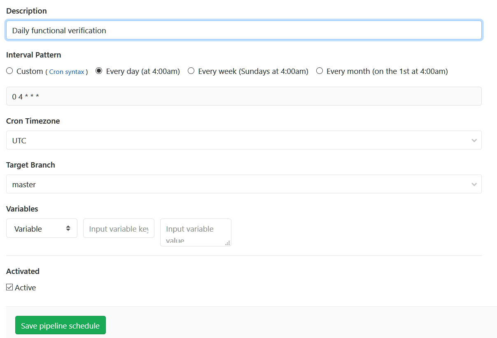
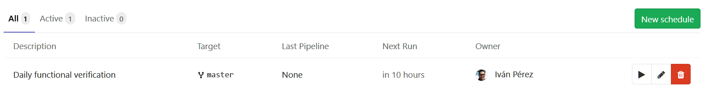

# **Bespoken Batch Tester**
[<p align="center"><a href="#installation">Installation</a> | <a href="#running-the-tester">Execution</a> | <a href="#gitlab-configuration">GitLab</a> | <a href="#datadog-configuration">DataDog</a></p>]()
This project enables batch testing of utterances for voice experiences.

It leverages Bespoken's Virtual Devices to run large sets of utterances through Alexa, Google Assistant, and other voice platforms.

## **Getting Started**
### **Installation**
**This package requires Node.js 10 or greater.**

To install the Bespoken Batch Tester, just run:  
```
npm install bespoken-batch-tester --save
```

We recommend creating a new project to store artifacts related to the tester, such as the testing configuration file, CI configuration, and custom source code.

### **Environment Management**
We use dotenv when running locally, which takes environment variables from a local `.env` file.

To set this up, just make a copy of `example.env` and name it `.env`. Replace the values inside there with the correct values for your configuration.

For running with continuous integration (such as Jenkins, Circle CI or Gitlab), these values should instead come from actual environment variables.

### **Virtual Device Setup**
* Create a virtual device with our [easy-to-follow guide here](https://read.bespoken.io/end-to-end/setup/#creating-a-virtual-device).
* Add them the configuration file, as described below

If you want to use multiple tokens, potentially for different purposes, leverage tags:
```json
{
  "virtualDevices": {
    "myToken": ["USAccount"],
    "myOtherToken": ["UKAccount"]
  }
}
```

The tags can then be assigned to a record with [record.addDeviceTag](https://bespoken.gitlab.io/batch-tester/Record.html#addDeviceTag):
```
record.addDeviceTag('USAccount')
```
Only tokens that have that tag (or tags) will be used to process it.

For more information on the best practices for virtual device management, [read our guide here]([docs/ACCOUNT_SETUP.md]).

### **Create a Configuration File**
Here is a bare minimum configuration file:
```json
{
  "job": "utterance-tester",
  "sequence": ["open my audio player"],
  "source": "csv-source",
  "sourceFile": "path/to/my/file.csv",
  "virtualDevices": {
    "myVirtualDevice": ["my-optional-tags"]
  }
}
```

To get started, cut and paste those settings into a new file, such as `batch-test.json`.

More information on configuring the batch test is below.

### **Running the Tester**
Once the configuration file is created, just enter:
```
bbt process batch-test.json
```

And it will be off and running. In practice, we recommend this not be run locally but in a CI environment.

The tester will create a results.csv file, as well as publish metrics to the configured metrics provider.

## **In-Depth Configuration**
The environment variables store sensitive credentials.

Our configuration file stores information particular to how the tests should run, but of a non-sensitive nature.

An example file:
```json
{
  "fields": {
    "imageURL": "$.raw.messageBody.directives[1].payload.content.art.sources[0].url"
  },
  "interceptor": "./src/my-interceptor",
  "job": "utterance-tester",
  "metrics": "datadog-metrics",
  "sequence": ["open my audio player"],
  "source": "csv-source",
  "sourceFile": "path/to/my/file.csv",
  "limit": 5
}
```

Each of the properties is explained below:
### **`fields`**
Each field represents a column in the CSV file.

By default, we take these columns and treat them as expected fields in the response output from the Virtual Device.

However, in some cases, these fields are rather complicated. In that case, we can have a field with a simple name, like `imageURL`, but then we specify a JSON path expression which is used to resolve that expression on the response payload.

This way we can perform complex verification on our utterances with a nice, clean CSV file.

### **`interceptor`**
The interceptor allows for the core behavior of the batch runner to be modified.

There are two main methods currently:  
* interceptRecord - Called before the record is processed
* interceptResult - Called before the result is finalized

Using [interceptRecord](https://bespoken.gitlab.io/batch-tester/Interceptor.html#interceptRecord), changes can be made to the utterance or the meta data of a record before it is used in a test.

Using [interceptResult](https://bespoken.gitlab.io/batch-tester/Interceptor.html#interceptResult), changes can be made to the result of processing. This can involve:
* Adding tags to the result (for use in metrics displays)
* Changing the `success` flag based on custom validation logic
* Adding output fields to the CSV output to provide additional information to report readers

You can read all about the Interceptor class here:
https://bespoken.gitlab.io/batch-tester/Interceptor.html

### **`limit`**
The numbers of records to test during test execution. Very useful when you want to try just a small subset of utterances.

### **`metrics`**
We have builtin two classes for metrics: `datadog-metrics` and `cloudwatch-metrics`.

This dictates where metrics on the results of the tests are sent.

Additionally, new metric providers can be used by implementing this base class:  
https://bespoken.gitlab.io/batch-tester/Metrics.html

### **`sequence`**
For tests in which there are multiple steps required before we do the "official" utterance that is being tested, we can specify them here.

Typically, this would involve launching a skill before saying the specific utterance we want to test, but more complex sequences are possible.

### **`source`**
The source for records. Defaults to `csv-source`. Additional builtin option is `s3-source`.

For the `csv-source`, the source file defaults to `input/records.csv`. This can be overridden by setting the `sourceFile` property:  
```
{ 
  "sourceFile
}
```

For the `s3-source`, a sourceBucket must be set. Additionally, AWS credentials must be set in the environment that can access this bucket.

## Advanced Execution
### Resuming A Job
To resume a job that did not complete, due to errors or timeout, simply set the `RUN_KEY` environment variable.

The run key can be found in the logs for any run - it will appear like this: 
```
BATCH SAVE completed key: 7f6113df3e2af093f095d2d3b2505770d9af1c057b93d0dff378d83c0434ec61
```

The environment variable can be set locally with:
```
export RUN_KEY=<RUN_KEY>
```

It can also be set in Gitlab on the `Run Pipeline` screen.

### Re-printing A Job
CSV reports can be reprinted at any time by running:  
```
bbt reprint <RUN_KEY>
```

The run key can be found in the logs for any run - it will appear like this: 
```
BATCH SAVE completed key: 7f6113df3e2af093f095d2d3b2505770d9af1c057b93d0dff378d83c0434ec61
```

### Re-processing A Job
Similar to reprinting the CSV results for a job, we can also run a job again applying different tests to the results.

This does NOT call the voice platforms again. Instead, it takes the responses from the platform and pushes them back through the post-processing logic.

This is useful to examine fields that were previously ignored or to change success/failure logic. It allows for fixing errors in the initial analysis without re-doing all the virtual assistant calls.

To use it, enter the following:  
```
bbt reprocess <TEST_FILE> <RUN_KEY>
```

The TEST_FILE is a the path to the test configuration. 
The RUN_KEY is the key, shown in the test output, that identifies the job in our storage.

An example call:
```
bbt reprocess input/bespoken-utterances.json 7f6113df3e2af093f095d2d3b2505770d9af1c057b93d0dff378d83c0434ec61
```

The run key can be found in the logs for any run - it will appear like this: 
```
BATCH SAVE completed key: 7f6113df3e2af093f095d2d3b2505770d9af1c057b93d0dff378d83c0434ec61
```

## **DataDog Configuration**
Follow [this guide](./docs/datadog#how-to-signup-and-get-an-api-key) to get started.

## **Gitlab Configuration**
The gitlab configuration is defined by the file `.gitlab-ci.yml`. The file looks like this:
```yaml
image: node:10

cache:
  paths:
  - node_modules/

utterance-tests:
  script:
   - npm install
   - npm test
  artifacts:
    when: always
    paths:
      - test_output/report/index.inline.html
      - test-report.xml
    reports:
      junit: test-report.xml
  only: 
    - schedules
    - web
```

When the GitLab Runner is executed, it takes this file and creates a Linux instance with Node.js, executes the commands under the `script` element, and saves the reports as artifacts.

#### **Setting a schedule**
It is very easy to run your end-to-end tests regularly using GitLab. Once your CI file (`.gitlab-ci.yml`) has been uploaded to the repository just go to "CI/CD => Schedules" from the left menu. Create a new schedule, it looks like this:

[](docs/images/GitLabCISchedule-1.png)

[](docs/images/GitLabCISchedule-2.png)

## **Test Reporting**
We have setup this project to make use of a few different types of reporting to show off what is possible.

The reporting comes in these forms:
* CSV File that summarizes results of utterance tests
* Reporting via AWS Cloudwatch
* Reporting via DataDog

Each is discussed in more detail below.

### **CSV File**
The CSV File contains the following output:

| Column | Description |
| --- | --- |
| name | The name of the receipt to ask for
| transcript | The actual response back from Alexa
| success | Whether or not the test was successful
| expectedResponses | The possible expected response back from the utterance

### **DataDog**
DataDog captures metrics related to how all the tests have performed. Each time we run the tests, and when `datadog` has been set as the `metric` mechanism to use in the `config.json` file, we push the result of each test to DataDog.

In general, we are using next metrics:
- `utterance.success`
- `utterance.failure`

The metrics can be easily reported on through a DataDog Dashboard. They also can be used to setup notifcations when certain conditions are triggered.

Read more about configuring DataDog in our [walkthrough](./docs/datadog.md).

## **Additional Topics**
* [Working With CloudWatch](./docs/cloudwatch.md)
* Working With Circle CI - TBC
* Working With PagerDuty - TBC
