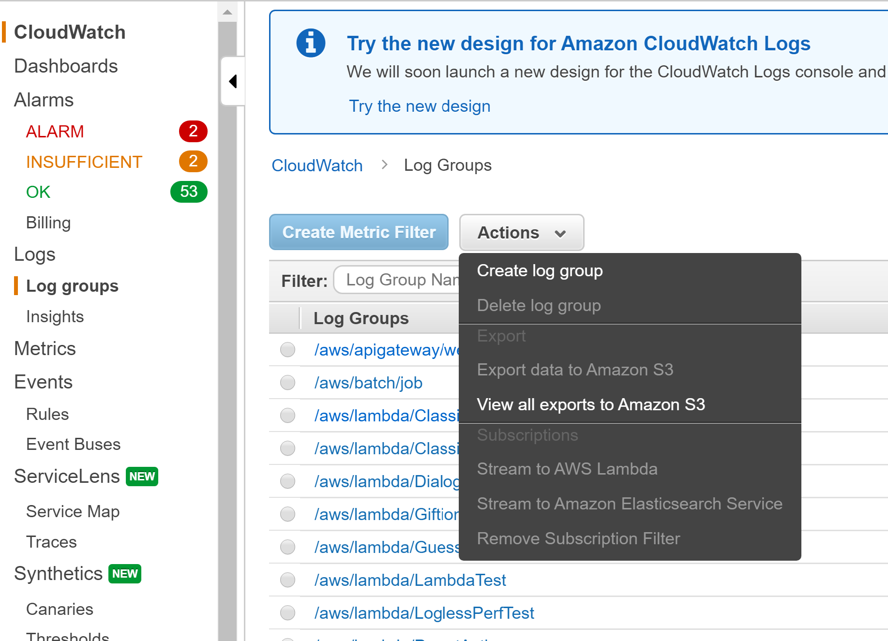
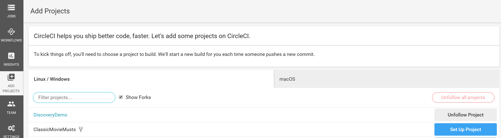
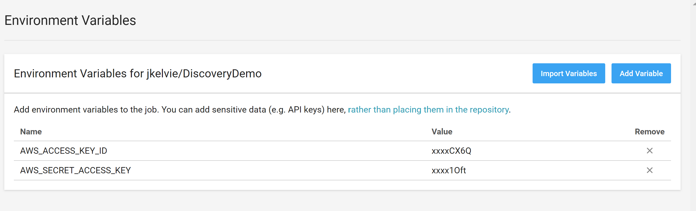
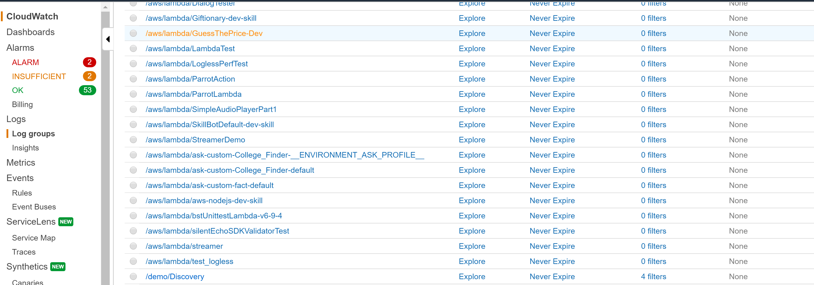
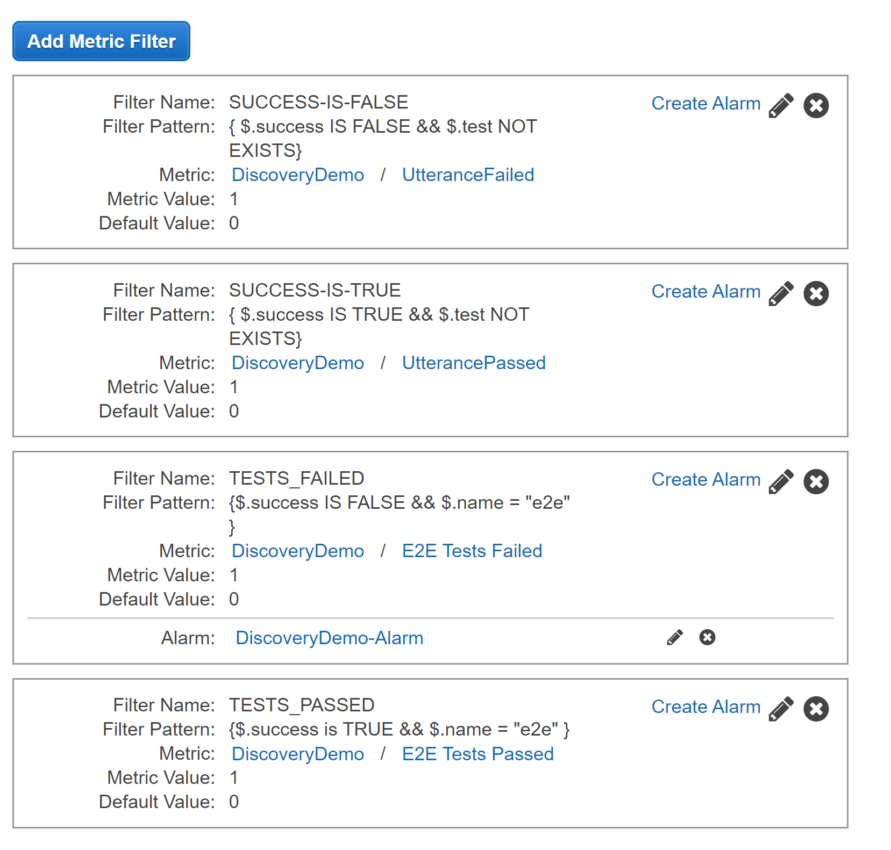
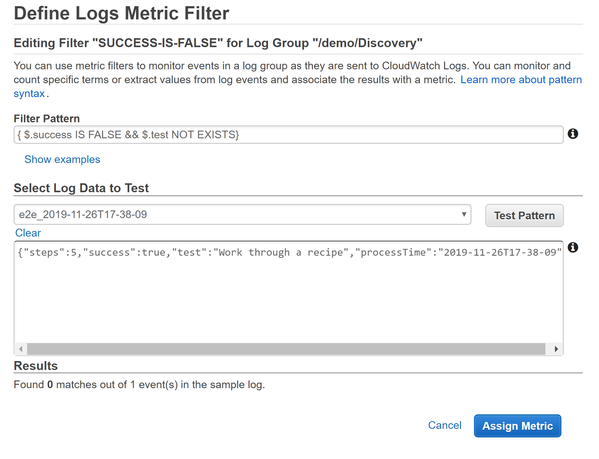
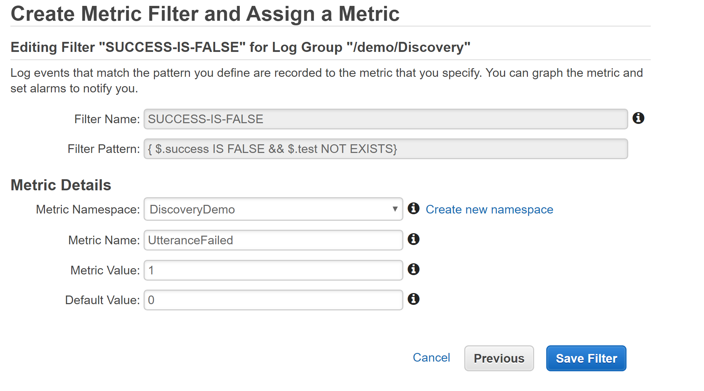
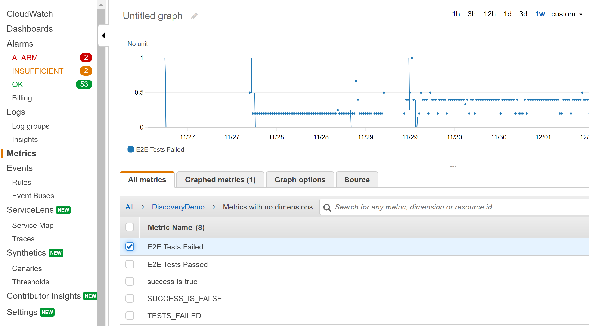
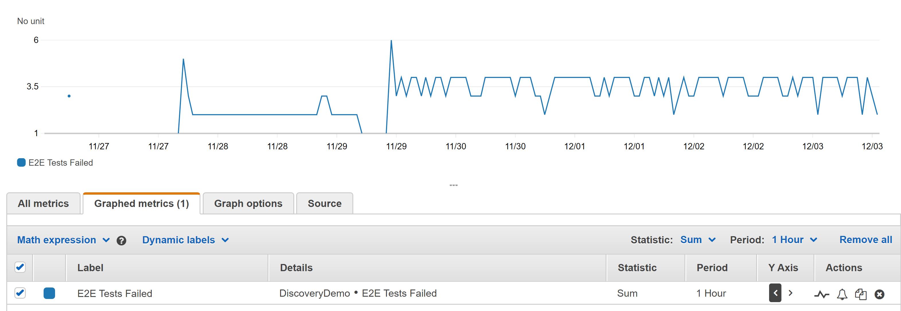

# Recipe Testing Example
This project provides a ready-to-use template for doing in-depth testing on a domain, such as recipes.

We have two primary types of tests:
* Utterance Tests - for testing speech recognition accuracy
* E2E Tests - for testing entire user functional workflows

The Utterances tests are defined via a CSV file.

The E2E tests are defined using our easy-to-maintain YAML scripts.

## Getting Setup
### Virtual Device Setup
Create a virtual device with our [easy-to-follow guide here](https://read.bespoken.io/end-to-end/setup/#creating-a-virtual-device).

Take the token for the virtual device you just created and add it to the testing.json file as the `virtualDeviceToken`.

### AWS CloudWatch Configuration
To publish test results to CloudWatch, you must configure the AWS credentials as environment variables.

The environment variables that must be set are `AWS_ACCESS_KEY_ID` and `AWS_SECRET_ACCESS_KEY`.

These either be set in a .env file at the root level or as typical environment variables. To use the .env file approach:
* Take the file `example.env`
* Rename it to `.env`
* Put in the correct values for the access key and secret access key values for your AWS environment

The AWS Credentials used should have full access to read and write within CloudWatch Logs.

### Configuring the CloudWatch Log Group
The code publishes results to a Log Group labeled `/demo/Discovery`. This can be changed to any name you like - the code is here:  
https://github.com/jkelvie/DiscoveryDemo/blob/master/lib/publisher.js#L10

The Log Group should be created in AWS first:  
<p align="center"></p>

Once the log group is created and the credentials are defined, running the tests will automatically send data to CloudWatch logs!

## Running E2E, multi-step recipe tests
Navigate to the directory were this project is cloned.

install the NPM packages:
```
npm install
```

To run the easy-to-read YAML tests, enter this command:
```
npm run e2e
```

This will run the tests defined under recipes.test.yml. These are tests that work through

## Running utterance resolution tests
These tests check whether or not the utterance names are being understood correctly by Alexa.

To run the CSV-driven tests, enter this command:
```
npm run utterances
```

This will test each utterance defined in the utterances.csv file. The CSV file contains the following fields:

| Column | Description |
| --- | --- |
| utterance | The utterace to be said to Alexa
| expectedResponses | One-to-many expected responses - each one is separated by a comma

For the initial entries, we are typically just looking for the name of the recipe in the response. When the tests are run, here is what will happen:  
> Bespoken Says: `get the recipe for giada chicken piccata`  

>Alexa Replies: `okay for giada chicken piccata I recommend quick chicken piccata 25 minutes to make what would you like start recipe send it to your phone or your next recipe`

This test will pass because the actual response contains the expected response from our CSV file.

## Continuous Integration Configuration
This project makes use of Circle CI. To get access to the environment, sign up with Circle CI, then send your username to jpk@bespoken.io.

We have configured our two jobs - the utterances testing and the e2e testing - to run every 30 minutes with Circle CI.

This is controlled via the [.circleci/config.yml](https://github.com/jkelvie/DiscoveryDemo/blob/master/.circleci/config.yml) file.

The schedule is configured like so:
```
workflows:
  twice-hourly:
    triggers:
      - schedule:
          cron: "0,30 * * * *" # Run every thirty minutes
          filters:
            branches:
              only:
                - master
    jobs:
      - test-e2e
      - test-utterances
```

We also added workflow labeled `manual`. This allows for manual builds to be kicked off at any time.

To leverage them, just add a release in Github that starts with `manual`, such as `manual-1`. This will trigger the CircleCI process to run.

We used Circle CI because it is *fairly* easy-to-use (we think much easier thank Jenkins) while also being quite powerful and having more advanced CI features.

### Configuring A New Circle CI environment
Alternatively, you can create your own Circle CI environment.

To set it up, fork this repo, and signup for you own account on Circle CI at https://circleci.com.

Once you have an account, select "Add Projects" on the left-hand side, then select "Setup Project" next to the project you want to build:  
<p align="center"></p>

The Circle Configuration file is already part of this repo, so on the next screen, choose "Start Building".

You will need to add your environment variables for the AWS Credentials. They go here:  
<p align="center"></p>

Once that is all set, the project will be automatically running all the tests every 30 minutes.

## Test Reporting
We have setup this project to make use of a few different types of reporting to show off what is possible.

The reporting comes in these forms:
* CSV File that summarizes results of utterance tests
* Reporting via Circle CI
* Reporting via AWS Cloudwatch

Each is discussed in more detail below.

### CSV File
The CSV File contains the following output:

| Column | Description |
| --- | --- |
| name | The name of the receipt to ask for
| actualResponse | The actual response back from Alexa
| success | Whether or not the test was successful
| expectedResponses | The possible expected response back from the utterance

### Circle CI
Circle CI provides pretty formatting of Jest test results created by our end-to-end tests.

It also provides a convenient storage place for our utterance CSV results.

For each run, these artifacts are saved off.
* [Example Utterance Results](https://app.circleci.com/jobs/github/jkelvie/DiscoveryDemo/8/artifacts)
* [Example E2E Test Results](https://app.circleci.com/jobs/github/jkelvie/DiscoveryDemo/7/tests)

### Configuring CloudWatch Metrics
CloudWatch is great for reporting on time series data, as well as setting up alerts and notifications.

To view the test results as nice reports, we make use of CloudWatch metrics. These filters turn the raw logs we send to CloudWatch into data that can be cleanly shown in graphs and used in alerts.

We set these up by going to the CloudWatch Log Groups screen, like so:  
<p align="center"></p>

Click on the column that says `x filters` (our screen says `4 filters`, yours will say `0 filters`).

You can then setup various metrics - they should look like this:  
<p align="center"></p>

Select add Metric Filter - the screen will look like this:  
<p align="center"></p>

Fill out the details of the metric and select assign:  
<p align="center"></p>

Make sure to set the Default Value to 0 on the Assign Metric screen.

The four metric filters we want to setup are:

| Metric | Description | Pattern |
| --- | --- | --- |
| UtterancePassed | Did the utterance test succeed | `{ $.success IS TRUE && $.test NOT EXISTS }`
| UtteranceFailed | Did the utterance test fail | `{ $.success IS FALSE && $.test NOT EXISTS }`
| E2E Test Passed | Did the E2E test pass | `{ $.success IS TRUE && $.name = "e2e }`
| E2E Test Failed | Did the E2E test pass | `{ $.success IS TRUE && $.name = "e2e }`

These filters will provide aggregate data around successes and failures for our two types of tests, which we can easily then graph and alert on.

### Viewing The Metrics in A Report
Once we have setup our metrics, we can create custom reports and graphs via the Metrics section of CloudWatch.

BEFORE TRYING THIS, make sure to run the tests at least once. Otherwise, there will be no data available to report on.

We add new graphs like so:  
<p align="center"></p>

We go to the Metrics section, select a Metric from the "All metrics" tab and add it to our graph.

Once added, we can change the period and the statistical function applied to the metric. We recommend using a period of 1 hour and the statistic of "Sum", like so:  
<p align="center"></p>

Once created, you can save the graph, incorporating it into Dashboards with other metrics and slicing and dicing the data as needed.

### Creating Alarms
One last step with CloudWatch - creating an alarm. We do this both for our integration with PagerDuty and to create standalone alarms.

To do this, just follow this guide from AWS:
https://docs.aws.amazon.com/AmazonCloudWatch/latest/monitoring/ConsoleAlarms.html

## Notifications
We are using PagerDuty for notifications. Email jpk@bespoken.io to get an invite.

We set up PagerDuty to work with CloudWatch using these instructions:  
https://support.pagerduty.com/docs/aws-cloudwatch-integration-guide

You can view the incidents related to the testing here:  
https://bespoken.pagerduty.com/incidents

Additionally, there is a helpful incident status page here:  
https://bespoken.pagerduty.com/status-dashboard

This can be shared with high-level stakeholders who are not necessarily involved in the day-to-day but are interested in what is happening.
