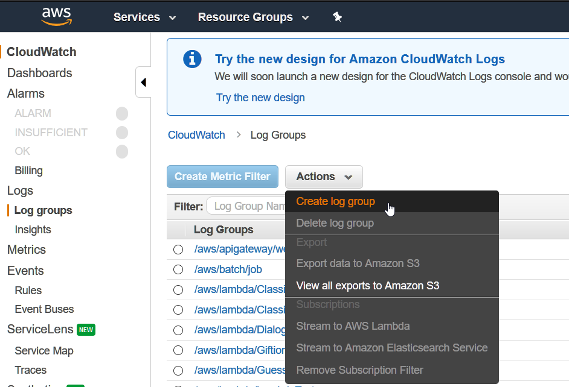
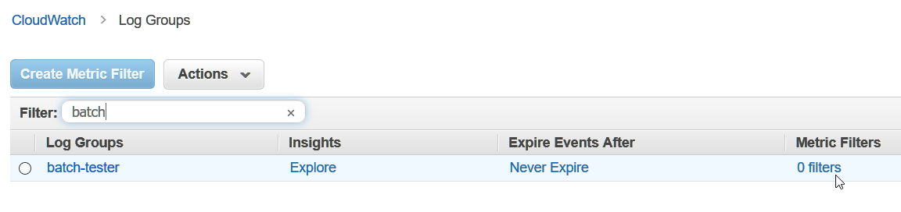
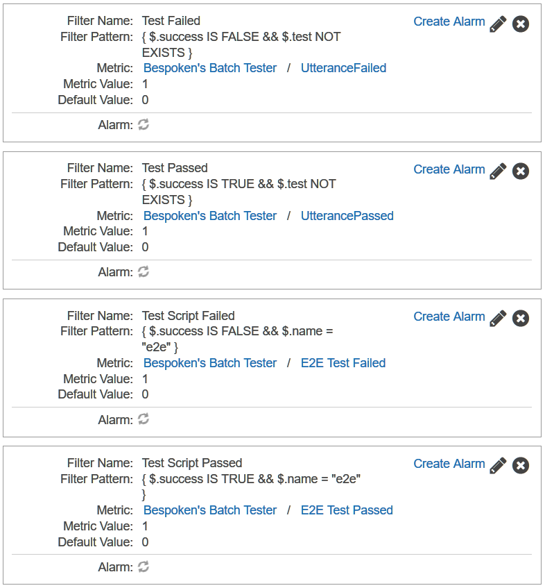
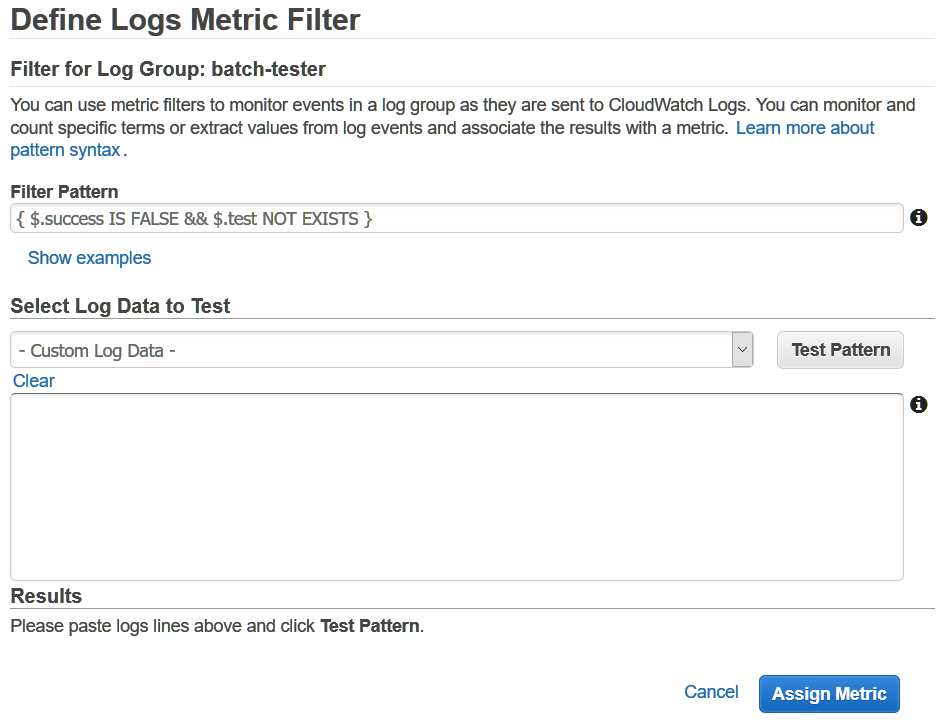
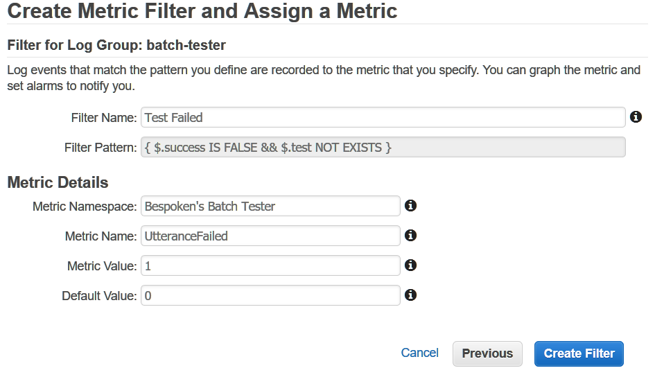
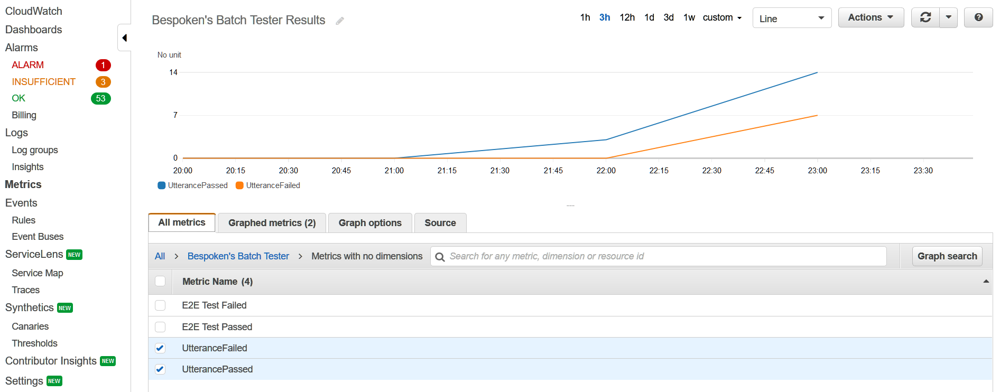
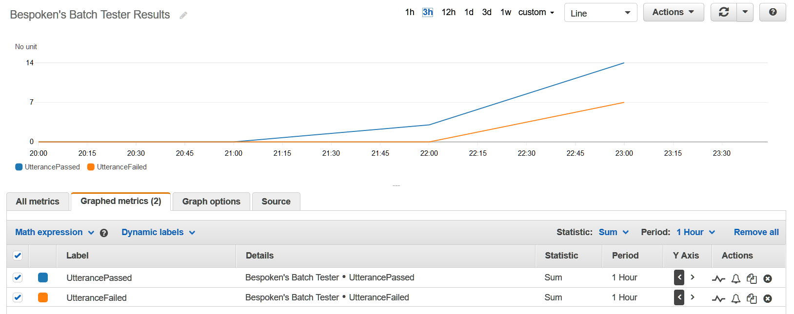

# **AWS CloudWatch Configuration**
To publish test results to CloudWatch, you must configure the AWS credentials as environment variables.

The environment variables that must be set are `AWS_ACCESS_KEY_ID` and `AWS_SECRET_ACCESS_KEY`.

These either be set in a .env file at the root level or as typical environment variables. To use the .env file approach:
* Take the file `example.env`
* Rename it to `.env`
* Put in the correct values for the access key and secret access key values for your AWS environment

The AWS Credentials used should have full access to read and write within CloudWatch Logs.

### **Configuring the CloudWatch Log Group**
The Log Group where the results are published can be set in the JSON configuration file by using the `cloudwatchLogGroup` key with the name you like, for example, "batch-tester". Remember to also set the `metrics` key to "cloudwatch-metrics".

The Log Group should be created in AWS first:  

Once the log group is created and the credentials are defined, running the tests will automatically send data to CloudWatch logs!

### **Configuring CloudWatch Metrics**
CloudWatch is great for reporting on time series data, as well as setting up alerts and notifications.

To view the test results as nice reports, we make use of CloudWatch metrics. These filters turn the raw logs we send to CloudWatch into data that can be cleanly shown in graphs and used in alerts.

We set these up by going to the CloudWatch Log Groups screen, like so:  

Click on the column that says `0 filters`.

You can then setup various metrics - they should look like this:  

Select **Add Metric Filter** - the screen will look like this:  

Fill out the details of the metric and select assign:  

Make sure to set the Default Value to 0 on the Assign Metric screen.

The four metric filters we want to setup are:

| Metric | Description | Pattern |
| --- | --- | --- |
| UtterancePassed | Did the utterance test succeed | `{ $.success IS TRUE && $.test NOT EXISTS }`
| UtteranceFailed | Did the utterance test fail | `{ $.success IS FALSE && $.test NOT EXISTS }`
| E2E Test Passed | Did the E2E test pass | `{ $.success IS TRUE && $.name = "e2e" }`
| E2E Test Failed | Did the E2E test pass | `{ $.success IS FALSE && $.name = "e2e" }`

These filters will provide aggregate data around successes and failures for our two types of tests, which we can easily then graph and alert on.

### **Viewing The Metrics in A Report**
Once we have setup our metrics, we can create custom reports and graphs via the Metrics section of CloudWatch.

BEFORE TRYING THIS, make sure to run the tests at least once. Otherwise, there will be no data available to report on.

We add new graphs like so:  

We go to the Metrics section, select a Metric from the "All metrics" tab and add it to our graph.

Once added, we can change the period and the statistical function applied to the metric. We recommend using a period of 1 hour and the statistic of "Sum", like so:  

Once created, you can save the graph, incorporating it into Dashboards with other metrics and slicing and dicing the data as needed.

### **Creating Alarms**
One last step with CloudWatch - creating an alarm. We do this both for our integration with PagerDuty and to create standalone alarms.

To do this, just follow this guide from AWS:
https://docs.aws.amazon.com/AmazonCloudWatch/latest/monitoring/ConsoleAlarms.html