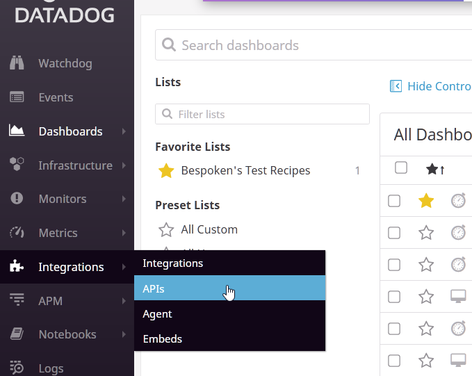
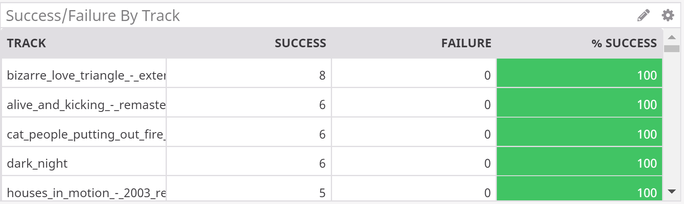

# **DataDog Reporting Configuration**

## **How to signup and get an API key**
[DataDog](https://www.datadoghq.com/) has several plans for different use cases. You can start a 14-day free trial and get your API Key to collect the test results on your dashboard, or use ours, included in our packaged solutions (for more information, [contact us](mailto:sales@bespoken.io)).

After the signup process, you can create your API key following these steps:
1. Select `APIs` from the left `Integrations` menu.

  [](images/DataDogCreatingAPIKey.png)

2. Create a new API key in the `API Keys` section.

Then you can copy the value to your `.env` file (use `DATADOG_API_KEY` as variable name), or add it as an environment variable on your CI settings.

## **Creating A Dashboard**
DataDog makes it easy to create a Dashboard:

1- Click on Dashboards, then select "New Dashboard" from the left menu. Give the Dashboard a name and select "New Timeboard":

[](images/DataDogCreatingDashboard2.png)

2- Click on "Add a graph". Drag the "Timeseries" widget to the rectangular area below:

[](images/DataDogCreatingDashboard3.png)

3- Define the JSON:
```json
{
  "viz": "timeseries",
  "requests": [
    {
      "q": "sum:utterance.success{*}.as_count()",
      "type": "bars",
      "style": {
        "palette": "cool",
        "type": "solid",
        "width": "normal"
      },
      "aggregator": "avg",
      "conditional_formats": []
    },
    {
      "q": "sum:utterance.failure{*}.as_count()",
      "type": "bars",
      "style": {
        "palette": "warm",
        "type": "solid",
        "width": "normal"
      }
    }
  ],
  "autoscale": true
}
```

4- Give your graph a title and click on the "Done" button.

Other types of charts and the JSON to create them are described below:
## DataDog Table - Success And Failure Grouped By Tags
Example chart:  

[](images/DataDogTable.png)

The JSON:  
```json
{
    "viz": "query_table",
    "requests": [
        {
            "q": "sum:utterance.success{customer:customerName} by {utterance}.as_count()",
            "conditional_formats": [],
            "alias": "Success",
            "aggregator": "sum",
            "limit": 100,
            "order": "desc"
        },
        {
            "q": "sum:utterance.failure{customer:customerName} by {utterance}.as_count()",
            "conditional_formats": [],
            "alias": "Failure",
            "aggregator": "sum"
        },
        {
            "q": "sum:utterance.success{customer:customerName} by {utterance}.as_count()/(sum:utterance.success{customer:customerName} by {utterance}.as_count()+sum:utterance.failure{customer:customerName} by {utterance}.as_count())*100",
            "conditional_formats": [
                {
                    "comparator": ">=",
                    "value": "90",
                    "palette": "white_on_green"
                },
                {
                    "comparator": "<",
                    "value": "70",
                    "palette": "white_on_red"
                },
                {
                    "comparator": "<",
                    "value": "90",
                    "palette": "white_on_yellow"
                }
            ],
            "alias": "% Success",
            "aggregator": "avg"
        }
    ]
}
```

### DataDog Query Value - a single value:  
Example chart:  
[](images/DataDogQuery.png)

The JSON:
```json
{
    "viz": "query_value",
    "requests": [
        {
            "q": "sum:utterance.success{customer:customerName}.as_count()/(sum:utterance.success{customer:customerName}.as_count()+sum:utterance.failure{customer:customerName}.as_count())*100",
            "aggregator": "avg",
            "conditional_formats": [
                {
                    "comparator": ">=",
                    "value": "90",
                    "palette": "white_on_green"
                },
                {
                    "comparator": "<",
                    "value": "70",
                    "palette": "white_on_red"
                },
                {
                    "comparator": "<",
                    "value": "90",
                    "palette": "white_on_yellow"
                }
            ]
        }
    ]
}
```

## **Creating Alarms**
DATADOG makes it easy to setup alarms, let's see how:  
1- Go to Monitors on the left menu and select "New Monitor":

[](images/DataDogCreatingAlarm1.png)

2- Select **Import** as the "monitor type":

[](images/DataDogCreatingAlarm2.png)

3- Paste below content in the monitor definition area:
```json
{
  "name": "Long audio test failed",
  "type": "metric alert",
  "query": "sum(last_1h):sum:utterance.failure{*}.as_count() >= 1",
  "message": "Please review test results and take action. @all",
  "tags": [],
  "options": {
    "notify_audit": true,
    "locked": false,
    "timeout_h": 0,
    "new_host_delay": 300,
    "require_full_window": false,
    "notify_no_data": false,
    "renotify_interval": "0",
    "escalation_message": "",
    "no_data_timeframe": null,
    "include_tags": true,
    "thresholds": {
      "critical": 1
    }
  }
}
```

4- Click on the "Save" button