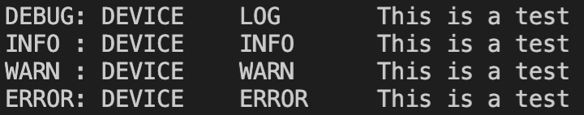
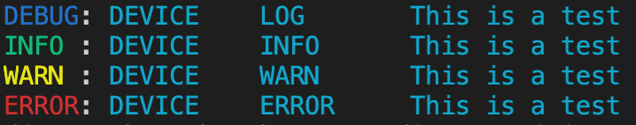
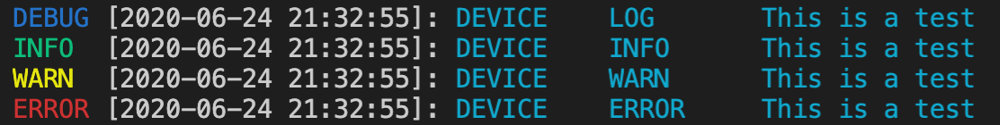
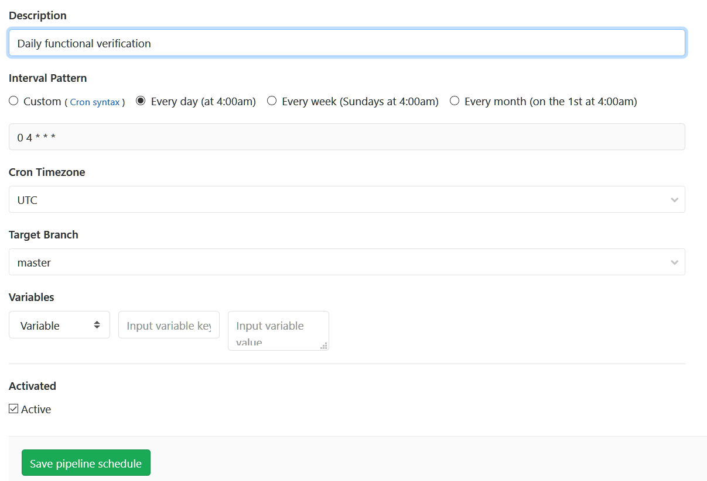
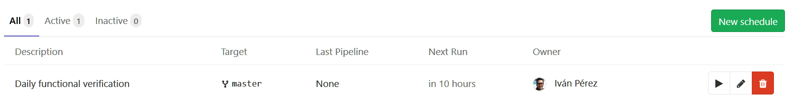

# **Bespoken Batch Tester**
[<p align="center"><a href="#installation">Installation</a> | <a href="#running-the-tester">Execution</a> | <a href="#gitlab-configuration">GitLab</a> | <a href="#datadog-configuration">DataDog</a> | <a href="https://bespoken.github.io/sdk/api/batch/">API Docs</a></p>]() 
This project enables batch testing of utterances for voice experiences.

It leverages Bespoken's Virtual Devices to run large sets of utterances through Alexa, Google Assistant, and other voice platforms.

## **Getting Started**
### **Installation**
**This package requires Node.js 10 or greater.**

To install the Bespoken Batch Tester, just run:  
```
npm install @bespoken-sdk/batch --save
```

We recommend creating a new project to store artifacts related to the tester, such as the testing configuration file, CI configuration, and custom source code.

### **Environment Management**
We use dotenv when running locally, which takes environment variables from a local `.env` file.

To set this up, just make a copy of `example.env` and name it `.env`. Replace the values inside there with the correct values for your configuration.

For running with continuous integration (such as Jenkins, Circle CI or Gitlab), these values should instead be set as actual values within the CI environment.

### **Virtual Device Setup**
* Create a virtual device with our [easy-to-follow guide here](https://read.bespoken.io/end-to-end/setup/#creating-a-virtual-device).
* Add them the configuration file, as described below

If you want to use multiple tokens, potentially for different purposes, leverage tags:
```json
{
  "virtualDevices": {
    "myToken": {
      "tags": ["USAccount"]
    },
    "myOtherToken": {
      "tags": ["UKAccount"],
      "settings": {
        "listener.maxDuration": 5
      }
    }
  }
}
```

The tags can then be assigned to a record with [record.addDeviceTag](https://bespoken.github.io/sdk/api/batch/Record.html#addDeviceTag):
```
record.addDeviceTag('USAccount')
```
Only tokens that have that tag (or tags) will be used to process it.

Additionally, per device settings can be set via the `settings` property. This allows for overriding the behavior of the device as needed.

For more information on the best practices for virtual device management, [read our guide here]([docs/ACCOUNT_SETUP.md]).

### **Create a Configuration File**
Here is a bare minimum configuration file:
```json
{
  "job": "utterance-tester",
  "sequence": ["open my audio player"],
  "source": "@bespoken-sdk/batch/lib/csv-source",
  "sourceFile": "path/to/my/file.csv",
  "virtualDevices": {
    "myVirtualDevice": { "tags": ["my-optional-tags"]}
  }
}
```

To get started, cut and paste those settings into a new file, such as `batch-test.json`.

More information on configuring the batch test is below.

### **Source Data**
Source data by default comes from a CSV file (by default, we look at `input/records.csv`).

The structure of the file is:

| Field | Required | Description|
| --- | --- | --- |
| utterance | Yes | The utterance to be said to the device
| device | No | The device value corresponds to the tag set on the device. If this value matches a tag, that device will be eligible to process this utterance.
| locale | No | The locale to use for this record. If not set, defaults to 'en-US'
| voiceID | No | The voice ID to use for this record. If not set, defaults to 'en-US-Wavenet-D'
| [expected values] | No | There can zero-to-many expected fields defined - these will automatically be compared to fields on the JSON output

#### *device* column
With regard to the `device` column, if we have two devices, like so:
```
  "virtualDevices": {
    "device1": { "tags": ["google"]},
    "device2": { "tags": ["alexa"]}
  }
```

If our record looks like this:
```csv
utterance,device,transcript
play despacito,alexa,playing the song you requested
```

The record will only be run with the device2, as it has the tag `alexa` that corresponds to our DEVICE value.

#### *expected value* columns
The expected field values will automatically be compared to the actual value on the response from the device.

For example, if we have a record like this:
```csv
utterance,transcript
play despacito,playing the song you requested
```

Our response from the virtual device may look like this:
```
{
  "transcript": "I don't know that one"
}
```

The actual transcript value will be compared to the expected one, and the test will be marked a failure or success based on a partial match comparison (i.e., the actual value must include the expected value though they do not need to be an exact match).

More complex field expressions can be handled with the `fields` configuration property, [described below](#fields).

### **Running the Tester**
Once the configuration file is created, just enter:
```
bbt process batch-test.json
```

And it will be off and running. In practice, we recommend this not be run locally but in a CI environment.

The tester will create a results.csv file, as well as publish metrics to the configured metrics provider.

## **In-Depth Configuration**
The environment variables store sensitive credentials.

Our configuration file stores information particular to how the tests should run, but of a non-sensitive nature.

An example file:
```json
{
  "fields": {
    "imageURL": "$.raw.messageBody.directives[1].payload.content.art.sources[0].url"
  },
  "interceptor": "./src/my-interceptor",
  "job": "utterance-tester",
  "saveInterval": 300,
  "limit": 5,
  "maxAttempts": 3,
  "backoffTime": 10,
  "metrics": "datadog-metrics",
  "sequence": ["open my audio player"],
  "sequential": false,
  "source": "@bespoken-sdk/batch/lib/csv-source",
  "sourceFile": "path/to/my/file.csv",
  "transcript": true,
  "virtualDevices": {
    "VIRTUAL_DEVICE_1": {
      "tags": ["tag1", "tag2"]
    }
  },
  "virtualDeviceConfig": {
    "phoneNumber": "+1 XXX XXX XXX",
    "twilio_speech_timeout": 2,
    "twilio_timeout": 10,
    "waitTimeInterval": 2000,
    "maxWaitTime": 300000 
  }
}
```

Each of the properties is explained below:
### **`fields`**
Each field represents a value in the JSON response. It will be added to the result output.

If the field also is a column in the CSV file, then the value in the CSV is compared to the value in the actual response. 

The fields can be mapped to complex JSON path values, such as: 
`"imageURL": "$.raw.messageBody.directives[1].payload.content.art.sources[0].url"`

The JSON path will be applied to the actual result from the response. If more than one value matches the JSON path expression, 
then if ANY of the actual values matches the expected the test will pass.

### **`interceptor`**
The interceptor allows for the core behavior of the batch runner to be modified.

There are six main methods:
* interceptRecord - Called before the record is processed
* interceptResult - Called before the result is finalized
* interceptError - Called when the process has an error after the max attempts
* interceptPreProcess - Called after the records have been loaded but before any of them is processed
* interceptPostProcess - Called after all the records have been executed
* interceptRequest - Called before the request is sent to a virtual device

Using [interceptRecord](https://bespoken.github.io/sdk/api/batch/Interceptor.html#interceptRecord), changes can be made to the utterance or the meta data of a record before it is used in a test.

Using [interceptResult](https://bespoken.github.io/sdk/api/batch/Interceptor.html#interceptResult), changes can be made to the result of processing. This can involve:
* Adding tags to the result (for use in metrics displays)
* Changing the `success` flag based on custom validation logic
* Adding output fields to the CSV output to provide additional information to report readers

Using `interceptError` custom code can be called after the max attempts were executed.

Using `interceptPreProcess` custom code can be called before starting the execution of the records. This can involve:
* Setting up a local storage
* Calling an API
Be aware that this function will be called when resuming too.

Using `interceptPostProcess` custom code can be called after the execution of the records. This can involve:
* Calling an API
* Saving objects to a local storage.

Using `interceptRequest` the request can be modified before calling the virtual device. This can involve:
* Adding more messages (before or after the main one)
* Adding phrases for better speech recognition
* Doing operations related to the virtual device about to be used

You can read all about the Interceptor class here:
https://bespoken.github.io/sdk/api/batch/Interceptor.html

### **`saveInterval`**
Time interval where the batch job is saved. It's represented in seconds.

This defaults to 300.

### **`limit`**
The numbers of records to test during test execution. Very useful when you want to try just a small subset of utterances.

### **`maxAttempts`**
The number of attempts to try if a request has errors. Defaults to 3.

### **`backoffTime`**
The time in seconds to wait before trying again. Defaults to 10.

### **`metrics`**
We have builtin two classes for metrics: `datadog-metrics` and `cloudwatch-metrics`.

This dictates where metrics on the results of the tests are sent.

Additionally, new metric providers can be used by implementing this base class:  
https://bespoken.github.io/sdk/api/batch/Metrics.html

### **`sequence`**
For tests in which there are multiple steps required before we do the "official" utterance that is being tested, we can specify them here.

Typically, this would involve launching a skill before saying the specific utterance we want to test, but more complex sequences are possible.

### **`sequential`**
Setting this to true forces records to be processed one after another and not in parallel, regardless of the number of virtual devices that are configured.

This defaults to false.

### **`source`**
The source for records. Defaults to `csv-source`.

For the `csv-source`, the source file defaults to `input/records.csv`. This can be overridden by setting the `sourceFile` property:  
```
{ 
  "sourceFile
}
```

To implement your own custom source, [read the API docs](https://bespoken.github.io/sdk/api/batch/Source.html).

### **`transcript`**
If set to false, speech-to-text is not performed on the audio response from the device

### **`virtualDevices`**
See the section above for information on [configuring virtual devices](#virtual-device-setup).

### **`virtualDeviceBaseURL`**
For values other than the default (`https://virtual-device.bespoken.io`), set this property.

### **`virtualDeviceConfig`**
Allows setting properties to all virtual devices. For example, when using Twilio Virtual Devices, setting the `phone_number` to call.

## Advanced Execution
### Resuming A Job
To resume a job that did not complete, due to errors or timeout, simply set the `RUN_KEY` environment variable.

The run key can be found in the logs for any run - it will appear like this: 
```
BATCH SAVE completed key: 7f6113df3e2af093f095d2d3b2505770d9af1c057b93d0dff378d83c0434ec61
```

The environment variable can be set locally with:
```
export RUN_KEY=<RUN_KEY>
```

It can also be set in Gitlab on the `Run Pipeline` screen.

### Re-printing A Job
CSV reports can be reprinted at any time by running:  
```
bbt reprint <RUN_KEY>
```

The run key can be found in the logs for any run - it will appear like this: 
```
BATCH SAVE completed key: 7f6113df3e2af093f095d2d3b2505770d9af1c057b93d0dff378d83c0434ec61
```

### Re-processing A Job
Similar to reprinting the CSV results for a job, we can also run a job again applying different tests to the results.

This does NOT call the voice platforms again. Instead, it takes the responses from the platform and pushes them back through the post-processing logic.

This is useful to examine fields that were previously ignored or to change success/failure logic. It allows for fixing errors in the initial analysis without re-doing all the virtual assistant calls.

To use it, enter the following:  
```
bbt reprocess <TEST_FILE> <RUN_KEY>
```

The TEST_FILE is a the path to the test configuration. 
The RUN_KEY is the key, shown in the test output, that identifies the job in our storage.

An example call:
```
bbt reprocess input/bespoken-utterances.json 7f6113df3e2af093f095d2d3b2505770d9af1c057b93d0dff378d83c0434ec61
```

The run key can be found in the logs for any run - it will appear like this: 
```
BATCH SAVE completed key: 7f6113df3e2af093f095d2d3b2505770d9af1c057b93d0dff378d83c0434ec61
```

### Merge csv results
We take 2 csv files and combine them into one csv file. The result will be located in `output/merged.csv` by default.

```
bbt merge [ORIGINAL_RESULTS_PATH] [RERUN_RESULTS_PATH]
```

The 2 arguments are optionals, they are by default:
- ORIGINAL_RESULTS_PATH = ./output/results.csv
- RERUN_RESULTS_PATH = ./output/rerun.csv

### Select output file
You can set the output filename using a flag in any of the commands above

```
bbt process batch-test.json --output_file your_custom_name
```

You will find the results in `/output/your_custom_name.csv`

### Output logging
We use overwritten versions of console log, debug, warn and info functions in conjunction with [pino.js](https://github.com/pinojs/pino) for logging. This allows us to change the verbosity of our logs (as well as the logs of projects that use the bespoken batch tester) by using the following log levels:

```
- trace
- debug
- info
- warn
- error
- fatal
```

On this project, calling `console.log` is equivalent to calling `console.debug`, while `trace` and `fatal` are not in use. Here's how a typical log looks:



To set a log level, simply set the following env variable: `export LOG_LEVEL=debug`. If not set, `info` is assumed.

We can also colorize the outputs by setting the env variable `COLORIZE`.



Timestamps can be added to the outputs by setting the env variable `DISPLAY_LOG_TIME`.



Finally, logs can be saved to a file by setting the env variable `SAVE_LOG_FILE`. The file will be placed in the `output` folder and named `batch-tester.log`. It uses pino.js default format.

## Type of Utterances
The record class accepts three types of utterances: text, URL and local audio files.

| Device | Support |
| --- | --- |
| Alexa | Text, URL, Local Audio File |
| Google Assistant | Text, URL, Local Audio File |
| Test Robot | Text, URL, Local Audio File |
| IVR | Text, URL |

### Text
```javascript
  const record = new Record('play a radio station')
```

### URL
```javascript
  const record = new Record('https://play.radio.com/1234.wav')
```

### Local audio file
The audio file path should start from the root path of your project
```
project/
|-subfolder/
  |- audios/
    |- radio123.wav
|- src/
  |- source.js
```
```javascript
  const record = new Record('./subfolder/audio/radio123.wav')
```

## **DataDog Configuration**
Follow [this guide](./docs/datadog#how-to-signup-and-get-an-api-key) to get started.

## **Gitlab Configuration**
The gitlab configuration is defined by the file `.gitlab-ci.yml`. The file looks like this:
```yaml
image: node:10

cache:
  paths:
  - node_modules/

utterance-tests:
  script:
   - npm install
   - npm test
  artifacts:
    when: always
    paths:
      - test_output/report/index.inline.html
      - test-report.xml
    reports:
      junit: test-report.xml
  only: 
    - schedules
    - web
```

When the GitLab Runner is executed, it takes this file and creates a Linux instance with Node.js, executes the commands under the `script` element, and saves the reports as artifacts.

#### **Setting a schedule**
It is very easy to run your end-to-end tests regularly using GitLab. Once your CI file (`.gitlab-ci.yml`) has been uploaded to the repository just go to "CI/CD => Schedules" from the left menu. Creating a new schedule looks like this:

[](docs/images/GitLabCISchedule-1.png)

[](docs/images/GitLabCISchedule-2.png)

## **Test Reporting**
We have setup this project to make use of a few different types of reporting to show off what is possible.

The reporting comes in these forms:
* CSV File that summarizes results of utterance tests
* Reporting via DataDog
* Reporting via SQLite and Metabase

Each is discussed in more detail below.

### **CSV File**
The CSV File contains the following output:

| Column | Description |
| --- | --- |
| name | The name of the receipt to ask for
| transcript | The actual response back from Alexa
| success | Whether or not the test was successful
| expectedResponses | The possible expected response back from the utterance

### **DataDog**
DataDog captures metrics related to how all the tests have performed. Each time we run the tests, and when `datadog` has been set as the `metric` mechanism to use in the `config.json` file, we push the result of each test to DataDog.

In general, we are using next metrics:
- `utterance.success`
- `utterance.failure`

The metrics can be easily reported on through a DataDog Dashboard. They also can be used to setup notifcations when certain conditions are triggered.

Read more about configuring DataDog in our [walkthrough](./docs/datadog.md).

### **MySQL and Metabase**
MySQL allows for reporting and querying via SQL. It can be combined with Metabase for easy exploration and visualization of the data.

Read more about using these tools in our [walkthrough](./docs/SQL.md).

## **Additional Topics**
* [Working With CloudWatch](./docs/cloudwatch.md)
* Working With Circle CI - TBC
* Working With PagerDuty - TBC
